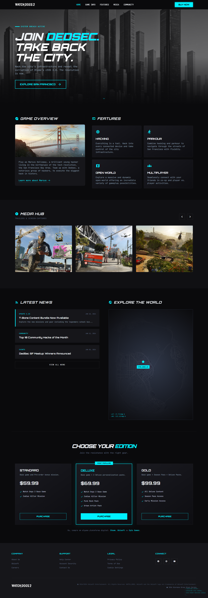

# WATCH_DOGS 2 — Landing Page (Fan Project)



Uma landing page moderna inspirada no universo de **Watch Dogs 2**, construída com React + TypeScript + Vite.  
O projeto apresenta uma experiência visual imersiva com identidade hacker/cyberpunk, foco em responsividade e componentes reutilizáveis.

## ✨ Visão Geral

Este projeto foi desenvolvido para recriar a atmosfera de Watch Dogs 2 em uma interface web elegante e dinâmica, incluindo:

- Hero section com destaque visual e chamada principal
- Navegação responsiva (desktop/mobile)
- Seções de overview e recursos do jogo
- Hub de mídia com slider manual
- Bloco de notícias com expansão de conteúdo
- Cards de edições do jogo com CTA de compra
- Rodapé completo e elementos visuais temáticos

## 🖼️ Preview

A imagem de preview está incluída diretamente no repositório:

- Arquivo: `watch_dogs-2.png`
- Exibição no README: logo no topo desta documentação

## 🧱 Stack Tecnológica

- **React 19**
- **TypeScript 5**
- **Vite 7**
- **ESLint 9**
- **CSS utilitário (estilo Tailwind-like já configurado no projeto)**

## 📂 Estrutura do Projeto

```bash
watch_dogs-2/
├─ public/
├─ src/
│  ├─ assets/
│  ├─ components/
│  │  ├─ layout/
│  │  │  ├─ Header/
│  │  │  ├─ Footer/
│  │  │  └─ HackerConsole/
│  │  ├─ sections/
│  │  │  ├─ HeroSection/
│  │  │  ├─ OverviewFeaturesSection/
│  │  │  ├─ MediaHubSection/
│  │  │  ├─ NewsWorldSection/
│  │  │  └─ EditionsSection/
│  │  └─ ui/
│  │     ├─ MaterialIcon/
│  │     └─ SectionHeading/
│  ├─ App.tsx
│  ├─ main.tsx
│  └─ index.css
├─ index.html
├─ package.json
└─ README.md
```

## ⚙️ Como Executar Localmente

### Pré-requisitos

- Node.js 18+ (recomendado)
- npm (ou gerenciador compatível)

### Passos

```bash
# 1) Instalar dependências
npm install

# 2) Rodar ambiente de desenvolvimento
npm run dev

# 3) Build de produção
npm run build

# 4) Visualizar build localmente
npm run preview
```

## 📜 Scripts Disponíveis

- `npm run dev` — inicia o servidor Vite em modo desenvolvimento
- `npm run build` — executa checagem TypeScript e gera build de produção
- `npm run lint` — executa lint do projeto
- `npm run preview` — sobe uma prévia local da build

## 🧩 Componentes e Seções

### Layout

- **Header**: menu responsivo, navegação por âncoras e botão “Buy Now”
- **Footer**: links institucionais, redes e créditos
- **HackerConsole**: overlay visual temático com textos estilo terminal

### Seções Principais

- **HeroSection** (`#home`): abertura com CTA principal
- **OverviewFeaturesSection** (`#game-info` / `#features`): visão geral + cards de recursos
- **MediaHubSection** (`#media`): galeria com navegação anterior/próxima
- **NewsWorldSection** (`#community`): feed de notícias com botão “View All News”
- **EditionsSection** (`#editions`): comparação de edições e botões de compra

## 🎯 Objetivos do Projeto

- Praticar arquitetura de componentes em React
- Trabalhar composição visual com identidade forte de marca
- Explorar interações de UI e responsividade
- Estruturar um projeto frontend com organização profissional

## 🚀 Possíveis Evoluções

- Integração com CMS/API para notícias e mídia reais
- Internacionalização (pt-BR/en-US)
- Testes de interface e acessibilidade
- Deploy contínuo (Vercel/Netlify)

## 👨‍💻 Autor

Desenvolvido por **Giordano Bruno Biasi Berwig**.

## 🛡️ Observações

Este é um projeto de estudo/fan project para fins educacionais e de portfólio.  
Marcas e propriedades intelectuais de Watch Dogs/Ubisoft pertencem aos seus respectivos detentores.
